# Expense Tracker

A full stack web app to track personal expenses. You can add, edit, and delete expenses, filter and sort them, and see the total, the number of expenses, and the highest expense. The data is saved in a PostgreSQL database through a Node.js and Express API.

## Technologies

- **Frontend:** HTML, CSS, JavaScript, Bootstrap 5, Chart.js
- **Backend:** Node.js, Express
- **Database:** PostgreSQL (`pg` library)

## Project structure

```
expense-tracker/
├── frontend/
│   ├── index.html
│   ├── css/style.css
│   └── js/app.js
├── backend/
│   ├── server.js
│   ├── package.json
│   ├── schema.sql
│   └── .env.example
└── README.md
```

## How to run

You need Node.js, PostgreSQL with pgAdmin, and VS Code with the **Live Server** extension.

### Backend

1. Open pgAdmin and create an empty database named `expense_tracker`.
2. Open the Query Tool on that database, load the file `backend/schema.sql`, and run it. This creates the `expenses` table and adds some sample data.
3. In the `backend` folder, copy `.env.example` to a new file named `.env` and write your own PostgreSQL password:

   ```
   DB_HOST=localhost
   DB_PORT=5432
   DB_USER=postgres
   DB_PASSWORD=your_password_here
   DB_NAME=expense_tracker
   ```

4. Open a terminal in the `backend` folder and install the packages:

   ```
   npm install
   ```

5. Start the server:

   ```
   npm start
   ```

   You should see `Server running on http://localhost:3000`. Keep the terminal open.

### Frontend

1. Open the `frontend` folder in VS Code.
2. Right-click `index.html` and choose **Open with Live Server**.
3. The app opens in the browser and loads the expenses from the server.

> The backend must be running, or the page will show an error message.

## Features

- [x] Add an expense (with validation)
- [x] Delete an expense
- [x] Edit an expense (in a modal)
- [x] Filter by category
- [x] Summary cards (total, count, highest)
- [x] Data is saved in a PostgreSQL database
- [x] Loading spinner and error alerts
- [x] Responsive design (CSS Grid and Bootstrap)

**Bonus features**

- [x] Chart of expenses by category (Chart.js)
- [x] Search by title
- [x] Filter by month
- [x] Sort the table by clicking a column title
- [x] Export expenses as a CSV file
- [x] Dark mode

## API endpoints

| Method | Path                | What it does         | Success | Errors   |
| ------ | ------------------- | -------------------- | ------- | -------- |
| GET    | `/api/expenses`     | Get all expenses     | 200     |          |
| GET    | `/api/expenses/:id` | Get one expense      | 200     | 404      |
| POST   | `/api/expenses`     | Add a new expense    | 201     | 400      |
| PUT    | `/api/expenses/:id` | Update an expense    | 200     | 400, 404 |
| DELETE | `/api/expenses/:id` | Delete an expense    | 200     | 404      |

**Example expense (JSON)**

```json
{
  "id": 1,
  "title": "Lunch",
  "amount": 4.5,
  "category": "Food",
  "date": "2026-01-15"
}
```

Allowed categories: `Food`, `Transport`, `Bills`, `Entertainment`, `Other`.

## Screenshots

**Desktop**

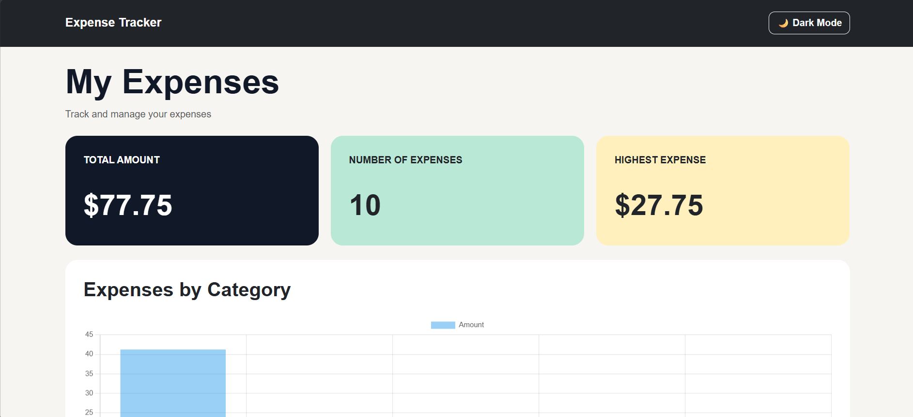
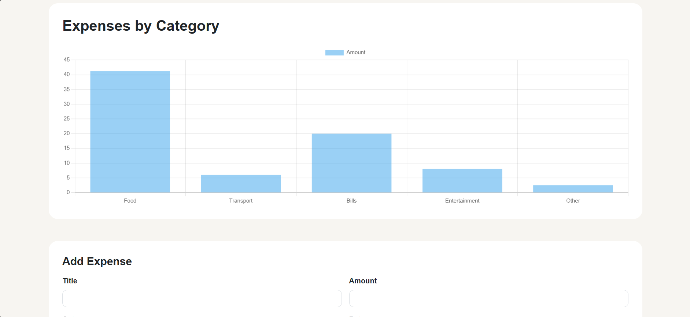
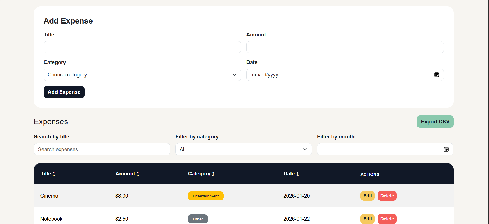
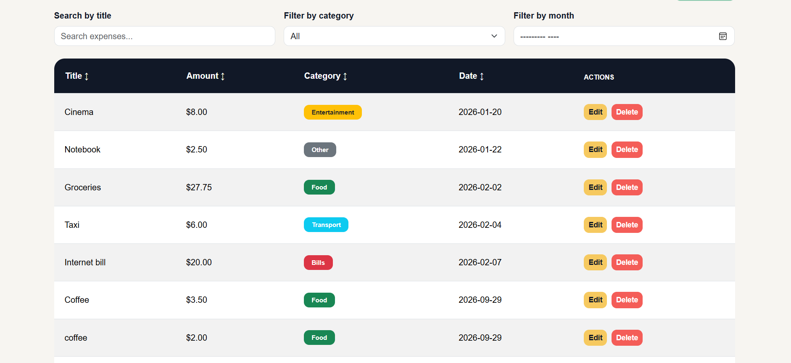

**Mobile**

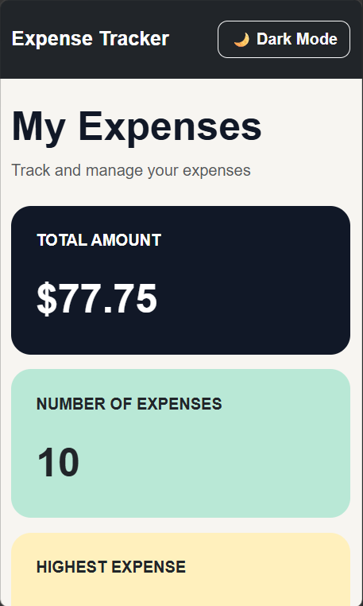
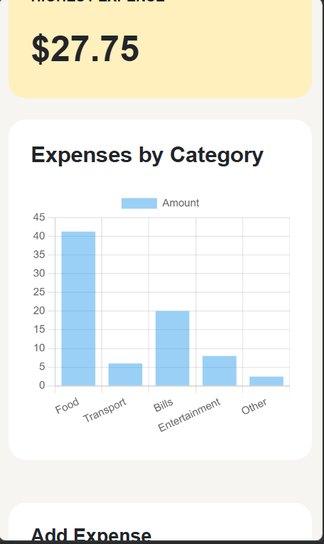
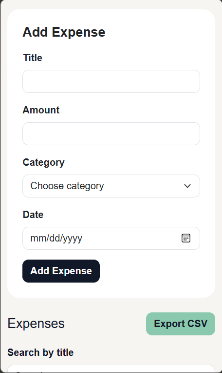
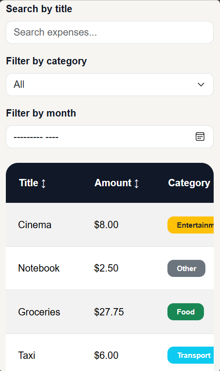
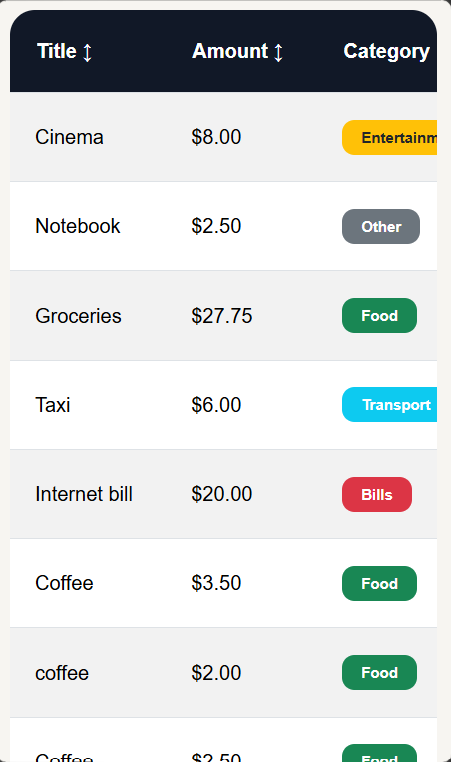

**Dark mode**

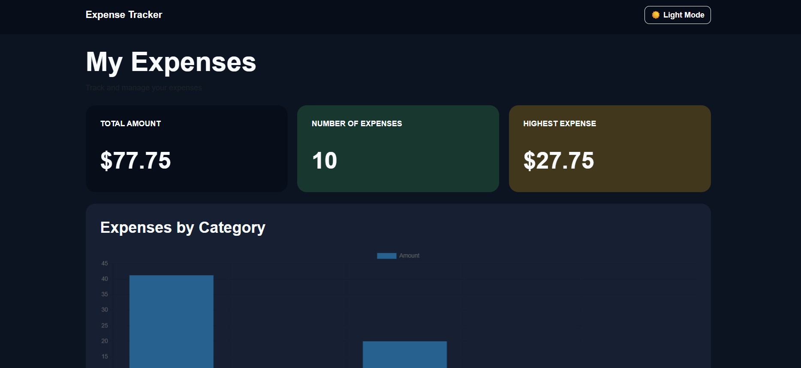
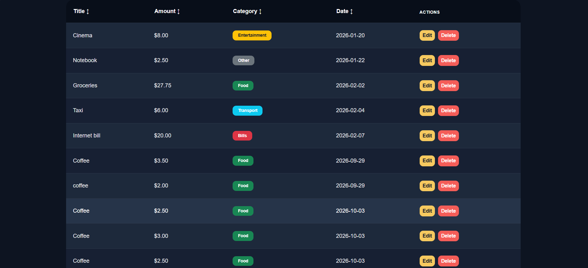

## Demo

[Watch the demo video](https://drive.google.com/file/d/1Gvwm0Znak9EtPsKxkpptshJqeWFdFytj/view?usp=drive_link)

## What was the hardest part?

The hardest part was making sure the data and the interface stayed synchronized. When I add, edit, or delete an expense, the table, the summary cards, and the chart all need to show the new data. To solve this, I made the server the single source of truth. After every add, edit, or delete, my code sends a request to the server and waits for it to confirm the change. Then it calls fetchExpenses(), which gets the full list again with a GET request. That one function redraws the table, recalculates the summary cards (total, count, and highest expense), and rebuilds the chart from the same data. I also had to destroy the old chart before drawing a new one, otherwise Chart.js shows an error. I learned that it is easier and safer to reload the data and redraw everything from one place than to update each part by hand.

